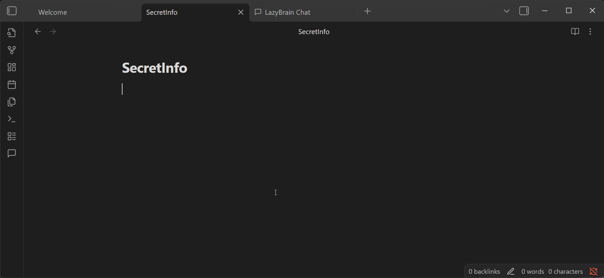
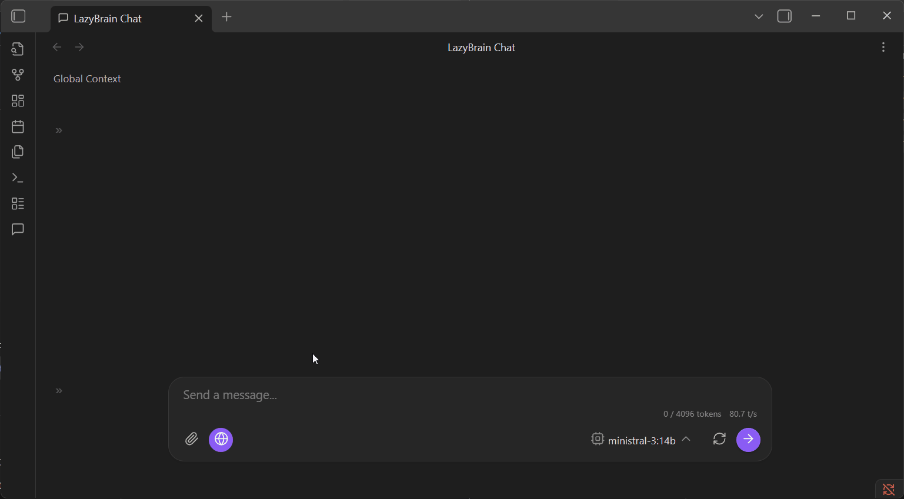
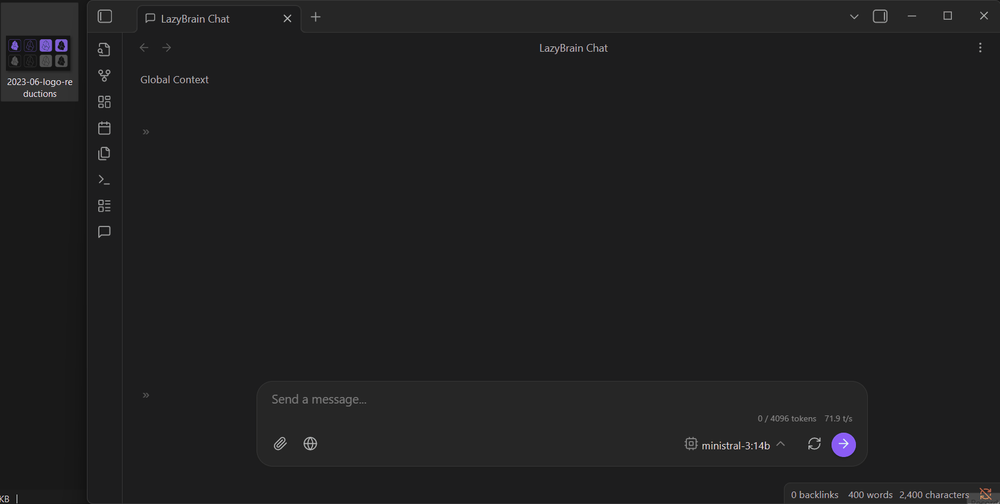
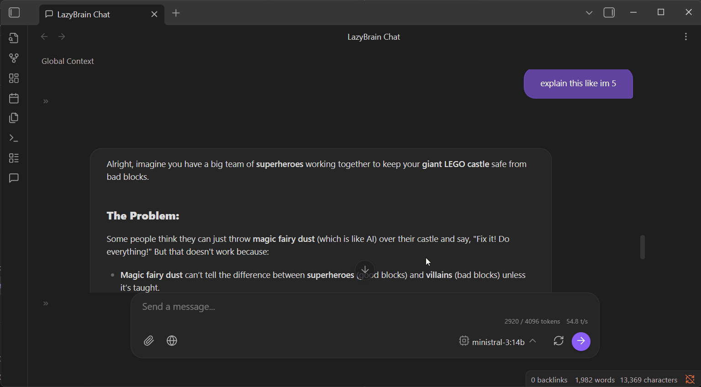

# LazyBrain 🧠

**LazyBrain** is a "lazy but smart" AI integration for Obsidian. It connects your local LLMs (Ollama, LM Studio) directly to your vault, letting you chat with your notes using RAG (Retrieval Augmented Generation) without lifting a finger.

> [!WARNING]
> **Disclaimer**
> This plugin is completely **vibecoded**. It was built with AI (Antigravity) and vibes alone. Use with caution. And check the code if you're paranoid.

> [!NOTE]
> **Maintenance**
> While I will try my best to fix issues and make updates, I cannot guarantee them since im not a developer. This is an experimental project, so updates will happen when the vibes are right.

- **Private**: No data leaves your machine (works 100% offline with Ollama/Local).
- **Lazy**: Auto-indexes your vault. Auto-scrolls. Auto-context.
- **Smart**: Uses vector search to find **relevant** notes to provide context for your questions.

## Features

### Major Features

-   **🤖 Local Privacy**: Designed to work with [LM Studio](https://lmstudio.ai/), [Ollama](https://ollama.com/), or any OpenAI-compatible local server. Your data stays on your machine.
-   **📚 Chat with Your Vault (RAG)**: Automatically indexes your notes to provide context-aware answers based on your own writing.
    
    

-   **📂 Workspaces & Projects**: Organize your chats into specific Projects with their own file contexts, or use the Global Workspace for everything.
-   **🌐 Web Access**: Optional integration with **Web Search** (powered by MCP) to let your local LLM search the internet for real-time info.

    

    > *Note: This feature can be hit-or-miss depending on your model. For best results, explicitly ask it to "search the web" or "Google this" in your prompt. Or in sys prompt.*

-   **⚡ AI Editor Custom Actions**:
    
    

      Template actions are included, but you can create your own custom prompts in Settings:
    -   *Summarize Selection*
    -   *Improve Writing*
    -   *Draft New Note*
    -   *Extract to Note*
    -   *Log to Daily Note*

### Quality of Life (Minor)

-   **🖼️ Image Support**: Drag & drop local images into the chat to analyze them (supports local files only).
    
    

-   **🌿 Conversation Branching**: Fork any conversation at any point to explore different ideas without losing the original thread.

    

-   **📎 Note Attachments**: Reference specific notes in your chat using `@Title`
-   **💾 Save to Note**: One-click save your entire chat conversation to a markdown file in your vault.

## For Users: 
- Backup your vault before installing.
- Review main.ts code (it's TypeScript, readable).
- Start with a test vault.
- Disable web search unless needed.

## Prerequisites

1.  **Local LLM Server**: You need a running local server.
    -   **Recommended**: [LM Studio](https://lmstudio.ai/) (Start server on port `1234`). [👉 Setup Guide](docs/LM_Studio_Setup.md)
    -   **Alternative**: Ollama. [👉 Setup Guide](docs/Ollama_Setup.md)
2.  **Node.js**: Required **only** if you want to use the **Web Search** feature (it runs a small backend service).

## Installation

1.  Download the latest release.
2.  Extract the `main.js`, `manifest.json`, and `styles.css` into your vault's plugin folder: `.obsidian/plugins/lazy-brain/`.
3.  Reload Obsidian and enable **LazyBrain**.

## Configuration

Go to **Settings > LazyBrain Settings**:

-   **Model URL**: Default is `http://localhost:1234/v1` (LM Studio default).
-   **API Key**: Default is `lm-studio` (can be anything for local servers).
-   **Context Window**: Sets the maximum size for the **Context Usage** meter (e.g., 4096 or 8192). This is visual only and helps you track how much context you're using relative to your model's limit.
-   **Web Search**: (Optional) Add your Brave Search API key to enable internet access for the model.

## Usage

### The Chat View
Click the **Message Icon** in the ribbon to open the Chat View.
-   **New Chat**: Start a fresh conversation.
-   **Projects**: Create projects to group related chats.
-   **Context**: The plugin automatically finds valid notes related to your query and feeds them to the LLM.

### Editor Custom Actions
Select any text in your editor, right-click, or use the Command Palette (`Ctrl/Cmd + P`) to run AI actions like "Summarize Selection".
*(These are starter templates—you can add your own custom prompts and actions in Settings!)*

## Safety & Security

> [!CAUTION]
> **Security Note**
> Because this code is AI-generated, please review security-critical sections (like `Custom Actions` or `Web Search`) yourself if you are planning to use it in a sensitive environment.

-   **No External Data Transfer**: Unless you enable Web Search, no data leaves your local network.
-   **Sandboxed**: Web search runs in a secure, local subprocess.

## Support ☕

If you like this plugin (and its vibes), feel free to buy me a coffee!

[https://ko-fi.com/lazybutai](https://ko-fi.com/lazybutai)

## Work with me 🛠️

Want to **vibecode** your own custom plugin?
I'm available for hire to build high-vibe, custom Obsidian plugins (or anything else).
Reach out if you want to turn your lazy ideas into smart code.

Shoot me a DM at:
https://x.com/lazybutai

## Contributing 🤝

This project is open for everyone! Feel free to fork it, update it, break it, or fix it.
Anyone is welcome to use this code and modify it however they want.

## License
MIT
