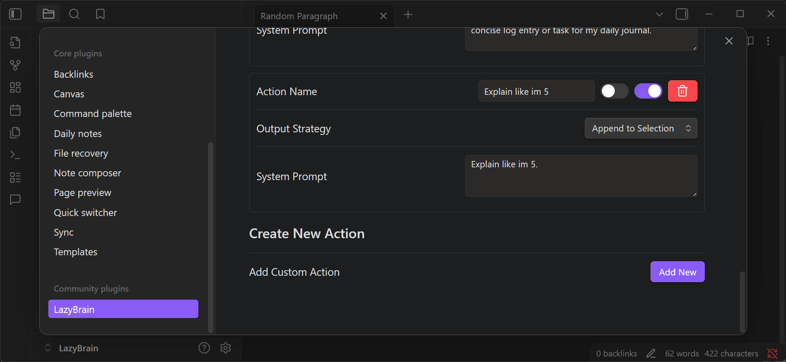

# Social Media Post (Final Draft) 📝

**Title:** I "vibecoded" a plugin to organize my daily brain dumps, and it got out of hand. Meet LazyBrain. 🧠

**Body:**
My main daily Obsidian use is writing a brain dump into a daily note. Since these entries can get quite long, I decided to **vibecode** a local AI plugin that can take the raw text and organize it automatically.

It went so well that I decided to polish it and post it for everyone.

_(First time posting here, so hopefully this doesn't break any rules!)_

**Other Features:**
It started with organization, but now it's a full Local AI suite:
*   **📚 Chat with your Vault (RAG)**: Ask questions and it finds the answers in your notes.
*   **🔒 Private & Local**: Works with Ollama & LM Studio. Data stays on your device.
*   **⚡ AI Actions**: Summarize, Rewrite, or Draft notes directly in the editor.
*   **🖼️ Multimodal**: Drag & drop images to analyze them.
*   **🌿 Branching**: Fork conversations to explore different paths.

⚠️ **Disclaimer:** This plugin is completely **vibecoded** (built with AI and vibes alone). Use with caution!

**Try it out:**
🔗 **GitHub**: [https://github.com/lazybutai/LazyBrain](https://github.com/lazybutai/LazyBrain)
